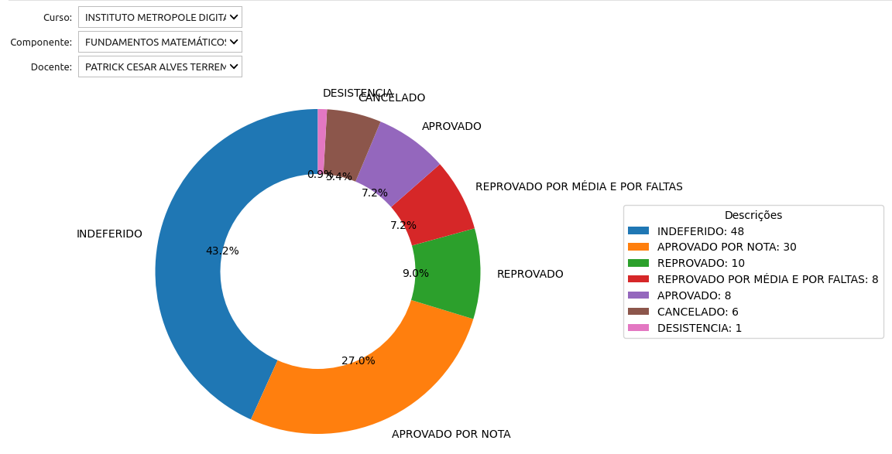
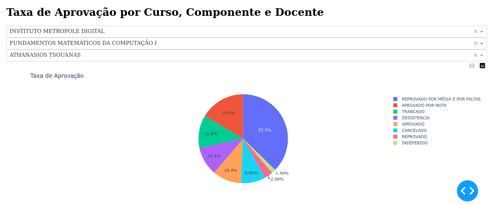
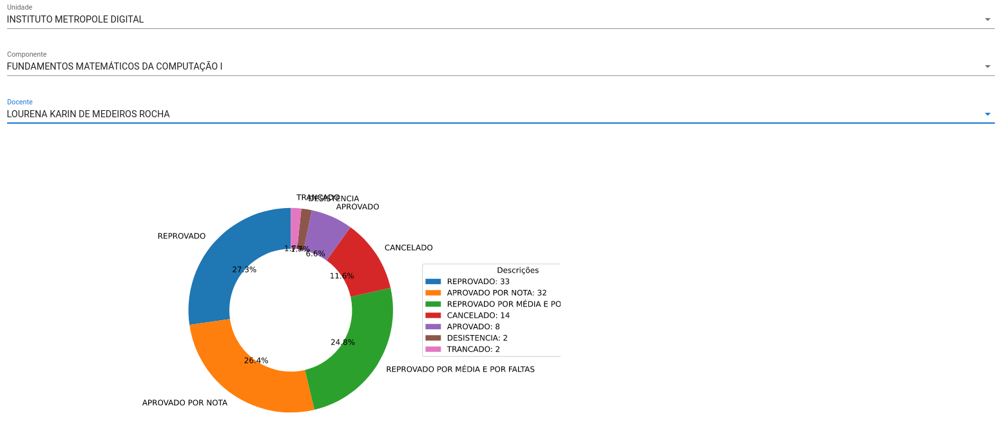
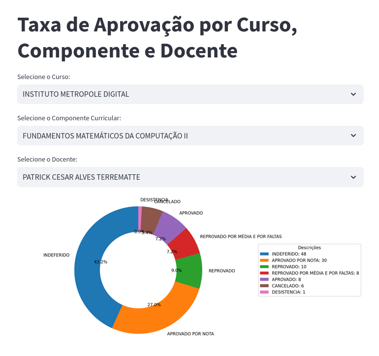

# Usando Python + Dados para desenvolver dashboards

Instale as dependências contidas em `requirements.txt`.

Esse repositório, além dos slides, contém códigos que utilizam 
diversas ferramentas para desenvolver dashboards que indiquem 
a taxa de aprovação de um professor na UFRN.

## Preparação dos dados

Execute o notebook `nbs/00_data_filtering.ipynb` para baixar, filtrar e 
compilar os [dados da UFRN](https://dados.ufrn.br/).

## Ipywidgets



Execute o notebook `nbs/01_ipywidgets.ipynb` para visualizar a aplicação 
rodando. Adicionalmente, instale a biblioteca [voilà](https://github.com/voila-dashboards/voila) 
para executar o notebook como uma aplicação web.

## Dash



Execute o notebook `nbs/02_dash.ipynb` para executar o servidor web que 
rodará a aplicação dash.

## Solara



Execute o notebook `nbs/03_dash.ipynb` para visualizar a aplicação. 
Adicionalmente, realize o download do notebook como arquivo python e 
execute `solara run arquivo_python.py` para executar o servidor web.

## Streamlit



Diferente das demais ferramentas, streamlit não foi desenvolvida 
para ser executada no ambiente Jupyter notebook. Execute o seguinte 
código para visualizar o web app.

```
streamlit run streamlit.py
```
